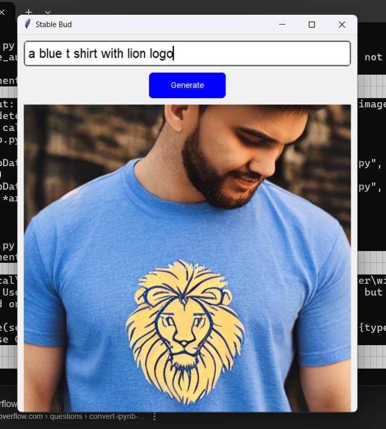
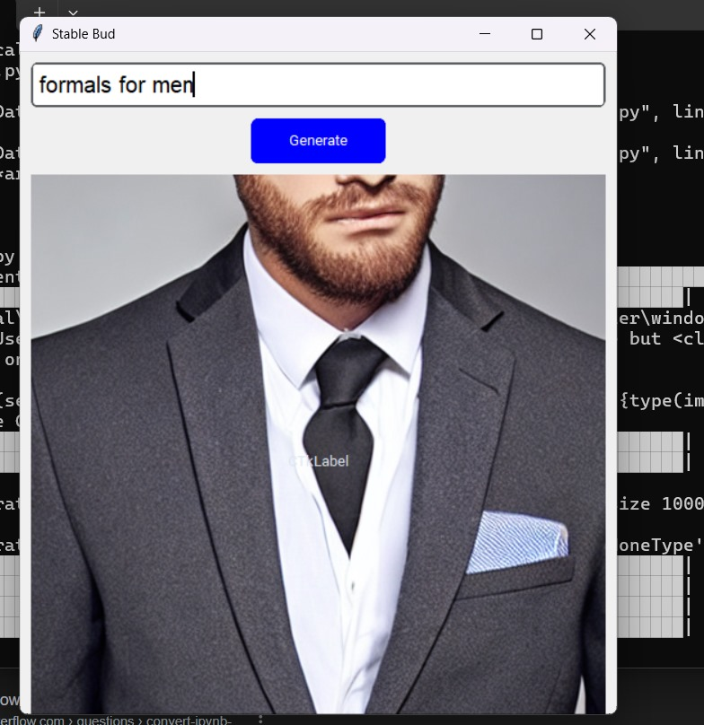
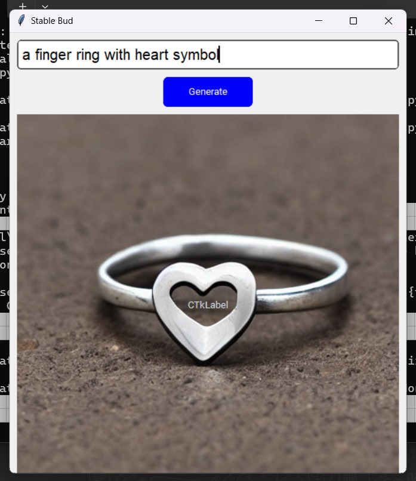

# Virtual Trial Room
------------
## Usage :
- Clone the project to your local machine : ```git clone https://github.com/Git-Cat-21/Virtual-Trial-Room.git```.
- Navigate to the project directory : ```cd Virtual-Trial-Room```
- Install the required dependencies ```pip install -r requirements.txt```
- Run the application: ```python app.py```


### Sample Images Generated by the Stable Diffusion Model:
#### Here are some examples of images created using the Stable Diffusion model:




